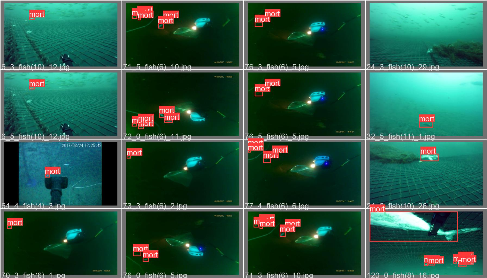

# Mort Detection using YOLOv5

This repository contains a Python script to detect morts (dead fish) in a given video using a custom YOLOv5 model.

## Model Information
- **Model Name:** best.pt
- **Architecture:** YOLOv5 X Large
- **Accuracy:** 97%
- **Model Size:** 166 MB

## Setup

1. Clone the repository:
    ```bash
    git clone https://github.com/your-username/mort-detection.git
    cd mort-detection
    ```

2. Install the required dependencies:
    ```bash
    pip install torch torchvision opencv-python
    ```

3. Place your model file `best.pt` in the project directory.

## Usage

Run the following command to detect morts in a video:

```bash
python detect_morts.py <path_to_input_video> <path_to_output_video>
```

Example:
```bash
python detect_morts.py input_video.mp4 output_video.mp4
```

## Sample Output


## Contributing

Feel free to open issues or submit pull requests for improvements or bug fixes.

## License

This project is licensed under the MIT License.
```
